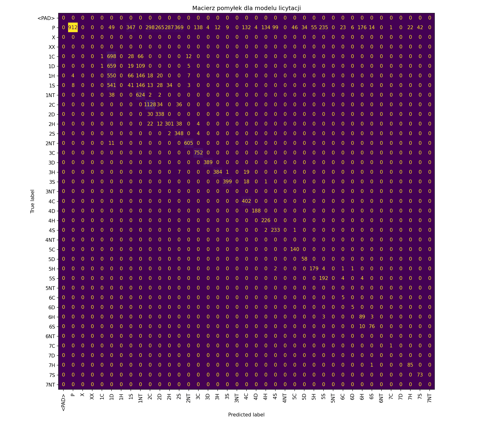

# Ver1

Accuracy: 0.8128972491701192
## Classification Report:
              precision    recall  f1-score   support

           P       1.00      0.87      0.93     27209
          1C       0.32      0.76      0.45      1205
          1D       0.37      0.05      0.08      1403
          1H       0.00      0.00      0.00       945
          1S       0.05      0.09      0.06      1040
         1NT       0.19      0.99      0.32       280
          2C       0.60      0.97      0.74       697
          2D       0.59      0.97      0.73       679
          2H       0.46      0.86      0.60       459
          2S       0.48      0.99      0.65       458
         2NT       0.45      1.00      0.62        73
          3C       0.93      1.00      0.96       601
          3D       1.00      1.00      1.00       689
          3H       0.98      0.98      0.98       453
          3S       1.00      1.00      1.00       509
          4C       0.95      1.00      0.98       289
          4D       0.99      1.00      1.00       318
          4H       0.98      1.00      0.99       243
          4S       1.00      1.00      1.00       253
          5C       1.00      1.00      1.00       133
          5D       1.00      1.00      1.00       150
          5H       0.73      0.98      0.84       200
          5S       0.94      0.93      0.94       256
          6C       0.57      1.00      0.73         4
          6D       1.00      1.00      1.00         3
          6H       0.33      0.99      0.49        77
          6S       0.80      0.96      0.87        71
          7H       0.97      0.97      0.97        79
          7S       0.87      1.00      0.93        85

    accuracy                           0.81     38861
   macro avg       0.71      0.87      0.75     38861
weighted avg       0.87      0.81      0.82     38861

# Ver2
## Classification Report:
          precision    recall  f1-score   support
          P       1.00      0.87      0.93     21925
          1C       0.50      0.00      0.00       805
          1D       0.26      0.83      0.39       793
          1H       0.00      0.00      0.00       811
          1S       0.08      0.05      0.06       814
         1NT       0.57      0.94      0.71       666
          2C       0.75      0.94      0.83      1198
          2D       0.48      0.92      0.63       368
          2H       0.48      0.80      0.60       377
          2S       0.44      0.98      0.60       354
         2NT       0.96      0.98      0.97       616
          3C       0.84      1.00      0.91       752
          3D       0.99      1.00      0.99       389
          3H       0.97      0.93      0.95       411
          3S       0.98      0.95      0.96       418
          4C       0.70      1.00      0.83       402
          4D       0.98      1.00      0.99       188
          4H       0.62      1.00      0.77       226
          4S       0.70      0.99      0.82       236
          5C       0.75      1.00      0.86       140
          5D       0.63      1.00      0.77        58
          5H       0.76      0.96      0.85       187
          5S       0.44      0.96      0.61       200
          6C       0.15      1.00      0.26         5
          6D       0.42      1.00      0.59         5
          6H       0.32      0.94      0.48        95
          6S       0.81      0.88      0.84        86
          7C       0.50      1.00      0.67         1
          7H       0.79      0.99      0.88        86
          7S       0.63      1.00      0.78        73

    accuracy                           0.83     32685
   macro avg       0.62      0.86      0.68     32685
weighted avg       0.86      0.83      0.83     32685

